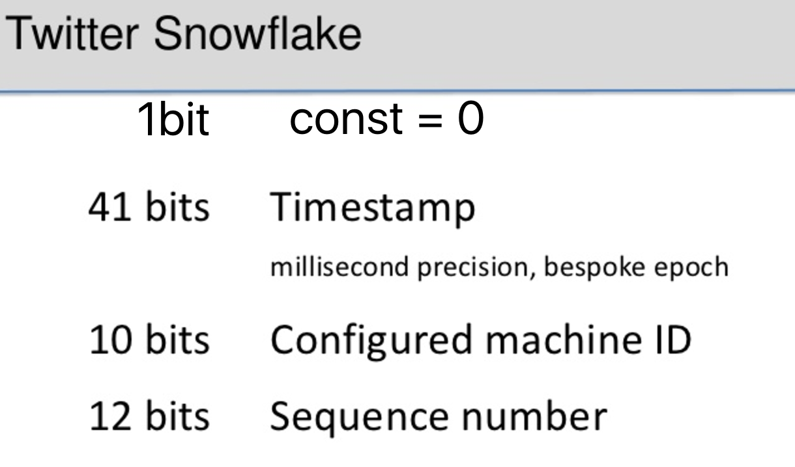

# snowflake ID 生成算法

<!-- TOC depthFrom:1 depthTo:6 withLinks:1 updateOnSave:1 orderedList:0 -->

- [snowflake ID 生成算法](#snowflake-id-生成算法)
	- [需求背景](#需求背景)
	- [设计欣赏](#设计欣赏)
	- [对比UUID](#对比uuid)
	- [Java实现](#java实现)
		- [使用样例](#使用样例)
		- [输出结果](#输出结果)
		- [源代码解析](#源代码解析)
		- [性能测试](#性能测试)
		- [FAQ](#faq)
	- [参考资料](#参考资料)

<!-- /TOC -->

## 需求背景

新浪科技讯 北京时间2012年1月30日下午消息，据《时代周刊》报道，在龙年新春零点微博抢发活动中，新浪微博发博量峰值再创新高，龙年正月初一0点0分0秒，共有 **32312** 条微博同时发布，超过Twitter此前创下的每秒25088条的最高纪录。

>每秒钟3.2万条消息是什么概念？1秒钟有1千毫秒，相当于每毫秒有32条消息（3.2万/1000毫秒=32条/毫秒）。如果我们需要对每条消息产生一个ID呢？要求做到：（1）自增有序：只要求有序，并不要求连续；（2）全局唯一：要跨机器，跨时间。

## 设计欣赏

我们直接看``snowflake``的设计：


接着我们按照需求来赏析下这个优秀的设计：

- **总共64bit**: 整个ID是64bit，即：8字节。可以展示为一个``Long``类型的整数。这在几乎所有的语言里都支持。

- **1bit不用**：第一个bit常为0，好处是无符号化。如果取1，按``Long``类型展示时，就会成负数，就违背了自增有序。

- **41bit的相对时间戳**：常规的时间戳，如果以毫秒数为单位的（比如Java语言以毫秒数为单位，Unix的则以秒为单位），本身就要用8B来存。现在41bit怎么能表现一个毫秒级的时间戳呢？？？但我们忽略了一点，常规的时间戳本身也是有参考系的，它是当前时间到``1970年1月1日00:00:00 UTC``对应的毫秒数（这里不妨以毫秒为单位）。换句话说，时间戳=0的意思并不是表示地球刚诞生，而是表示``1970年1月1日00:00:00 UTC``。同样的道理，我们可以重新选择一个参考点，比如我们项目立项时间，它也许是2014-01-01号，当然时区也选UTC，然后我们用41bit存储跟它的时间差。这意味着，从项目立项算起，这个ID系统能够使用 **69年**，计算：(2^41)毫秒/1年=(2^41)毫秒/(1000*60*60*24*365)毫秒 = 69.73。

- **10bit的机器码**：不同的机器分配一个编号，10bit能编码1024台机器（2^10=1024）。目前来讲，还是很少有某个单一应用需要1024台机器的（``GFS``有这么大的集群）。这个机器码我们可以配置，比如手工指定为0号、1号、2号等；当然也可以弄两层结构，比如前3bit表示机房（可表达8个机房，比如杭州机房，北京机房等），后7bit表示机房的机器（可表达128台机器）。当然，我们还可以不用配置，比如获取机器的MAC地址的部分信息（前提是要搞明白MAC编码规则，区分不同机器）；也取机器的内网IP的后几位。最后值得提醒的是，**这里叫机器码严格意义上不准确，应该是进程**。同一个机器的不同进程，这10bit必须不一样。

- **12bit序列号**：本文开篇案例，新浪微博消息数 **32条/毫秒**，意味着即使前面时间+空间都做到了唯一还不够，因为1个毫秒内都有32个重复。所以必须有个自增机制，来处理同一个机器，同一个毫秒内，区分不同消息。12bit能表达4096条消息。

- **灵活配置**：看完上面默认配置，69年足够用，每毫秒4096条消息也足够用，1024台机器也足够用。但是如果我们从MAC地址来计算机器码，要限制在10bit里面，估计还蛮费劲，这时我们完全可以把12bit的序列号，弄成6bit，能表达64毫秒。把机器码从10bit弄成16bit，这样可以直接去IP地址的后2个字节。

- **无需持久化**: 很多其他ID生成机制，如果需要做到序号自增，往往需要持久化，专门记录当前生成到哪个点了。而这个设计完全不用持久化，这是保证性能非常重要的原因之一。

- **ID有含义/可逆性**: ID可以反解出来，加入我们对ID进行统计分析，我们可以很简单的分析出整个系统的繁忙曲线。还可以下钻到每个机器，在某段时间分别承担了多少工作，很容易分析出负载均衡情况。这个特性对系统监控非常有价值。

- **高性能**: 在Mac Pro上，单线程（无竞争）测试的QPS：4百多万。每毫秒逼近4096的极限值。

设计者把这个算法叫做``snowflake``，雪花。相当文艺，又相当有蕴意的。从小就被知每片雪花都是不一样的，另外雪花从天空飘落下来就是大致有序的（表达了同一个机器严格有序，不同机器大致有序），最后雪花茫茫一片符合互联网海量的意思。看看下面雪花gif图片，是不是觉得``twitter``的工程师们相当有诗意？


## 对比UUID

``UUID``的特点：
- 全局唯一：``snowflake``也能做到全局唯一。
- 没有顺序：UUID排序没有物理意义。而``snowflake`` ID排序是能保证同一个机器的一定有序，不同机器的大概有序（取决时间同步情况）。
- 16字节：需要的空间是16字节，而``snowflake``是8字节。在多数语言里面都能用``Long``类型数据显示。所以，``UUID``通常用十六进制形式显示，比如：``6bd19fe7-7b3d-45a0-bb07-41e46df9242d``。

## Java实现

### 使用样例

``` java
// 构造方法设置机器码：第2个机房的第5台机器
Snowflake snowflake = new Snowflake(2, 5);
// 连续产生6个序号
for (int i = 0; i < 20; i++) {
   long id = snowflake.nextId();
	 System.out.println(String.format("%s => id: %d, hex: %s, bin: %s", snowflake.formatId(id), id,
					BinHexUtil.hex(id), BinHexUtil.bin(id)));
}
```

### 输出结果

```
2017-09-15 17:35:04.848, #0, @(2,5) => id: 225912364091068416, hex: 03229A1924045000, bin: 0000001100100010100110100001100100100100000001000101000000000000
2017-09-15 17:35:04.892, #0, @(2,5) => id: 225912364275617792, hex: 03229A192F045000, bin: 0000001100100010100110100001100100101111000001000101000000000000
2017-09-15 17:35:04.893, #0, @(2,5) => id: 225912364279812096, hex: 03229A192F445000, bin: 0000001100100010100110100001100100101111010001000101000000000000
2017-09-15 17:35:04.893, #1, @(2,5) => id: 225912364279812097, hex: 03229A192F445001, bin: 0000001100100010100110100001100100101111010001000101000000000001
2017-09-15 17:35:04.894, #0, @(2,5) => id: 225912364284006400, hex: 03229A192F845000, bin: 0000001100100010100110100001100100101111100001000101000000000000
2017-09-15 17:35:04.894, #1, @(2,5) => id: 225912364284006401, hex: 03229A192F845001, bin: 0000001100100010100110100001100100101111100001000101000000000001
```

从输出结果看出，由于``System.out.println``IO操作比较耗时，导致前后两次生成ID的时间间隔偶尔会超过1毫秒。超过1毫秒的，序号字段会是``#0``；没超过1毫秒的，序号字段会累加。

### 源代码解析

本文的``Snowflake.java``第一版是参考 [twitter/snowflake](https://github.com/twitter/snowflake) 的 ``snowflake-snowflake-2010``版的 ``IdWorker.scala``写的。

``` java
public synchronized long nextId() { // note-1
		long currTimestamp = timestampGen(); // note-2

		if (currTimestamp < lastTimestamp) { // note-3
			throw new IllegalStateException(
					String.format("Clock moved backwards. Refusing to generate id for %d milliseconds",
							lastTimestamp - currTimestamp));
		}

		if (currTimestamp == lastTimestamp) { // note-4
			sequence = (sequence + 1) & maxSequence;
			if (sequence == 0) { // overflow: greater than max sequence
				currTimestamp = waitNextMillis(currTimestamp);
			}

		} else { // reset to 0 for next period/millisecond
			sequence = 0L; // note-5
		}

		// track and memo the time stamp last snowflake ID generated
		lastTimestamp = currTimestamp;

		return ((currTimestamp - epoch) << timestampLeftShift) | // note-6
				(datacenterId << datacenterIdLeftShift) | //
				(workerId << workerIdLeftShift) | // new line for nice looking
				sequence;
	}

	protected long waitNextMillis(long currTimestamp) {
			while (currTimestamp <= lastTimestamp) {
				currTimestamp = timestampGen();
			}
			return currTimestamp;
		}

	protected long timestampGen() {
			return System.currentTimeMillis();
	}
```

- 代码``note-1``处：加``synchronized``，为了线程安全。因为``Snowflake``是一个有状态的对象，里面维护了两个重要变量``lastTimestamp``和``sequence``，每次运行``nextId()``方法后，它两都会变更。``lastTimestamp``记录着上一个ID生成时的时间戳。``sequence``记录着在1ms内，多次调用``nextId()``的次数，在同一个毫秒内，``sequence``表现的是这个毫秒内被调用的次数；越过这个毫秒，它又重新从0计数。
- 代码``note-2``处：通过系统调用，获取系统的当前时间。每次调用``nextId()``时，都会重新获取系统时间。
- 代码``note-3``处：每次调用``nextId()``时，都会重新获取系统时间。如果某次当前时间，比上一次记录的时间还要小，也就是时光倒退了（很可能是系统管理员重新校对了系统时间）。这个是不允许的，时间只能向前推进，否则就会导致ID可能重复，即使没重复，也导致ID无序。
- 代码``note-4``处：``if (currTimestamp == lastTimestamp)``，表示本次调用跟上一次调用，落在同一个毫秒内。ID的生成依靠三个部分：相对毫秒数（相对用户给定的``epoch``时间，比如项目立项时间）、机器ID（确切说是全局进程编号）和自增序号。现在两次调用落在同一个毫秒内，说明前两部分不足以区分ID，必须靠第3部分的自增序号来区分。于是``sequence = (sequence + 1) & maxSequence;``表示序号自增1，后面的按位与后，再判断``if (sequence == 0)``，实现的逻辑相当于``sequence++; if (sequence > maxSequence)``，只不过按位操作计算性能更高。**如果在同一个机器（网络进程），同一个毫秒内，序号自增还越界了，那没办法再生成新序号了，只能等下一个毫秒**。所以，``sequenceBits``默认12bit，不能太小，比如如果只分配3bit，那么最多一毫秒产生8个序号，按新浪微博的峰值，32条/毫秒，就不够用，就得等下一个毫秒，就会成为性能瓶颈。
- 代码``note-5``处：执行到这个分支的前提是``currTimestamp > lastTimestamp``，说明本次调用跟上次调用对比，已经不再同一个毫秒内了。这个时候序号可以重新回置0了。
- 代码``note-6``处：这个语义一目了然，就是用相对毫秒数、机器ID和自增序号，3个东西，按顺序拼接成8字节的Long类型数据。需要提醒的是这里的毫秒数是相对的，相对``epoch``的时间点。所以会有``currTimestamp - epoch``的逻辑。

另外一部分代码，关于``Snowflake``的设置的：

``` java
/**
	 * 'time stamp' here is defined as the number of millisecond that have
	 * elapsed since the {@link #epoch} given by users on {@link Snowflake}
	 * instance initialization
	 */
	private final long timestampBits = 41L;
	private final long datacenterIdBits = 5L;
	private final long workerIdBits = 5L;
	private final long sequenceBits = 12L;

	/*
	 * max values of timeStamp, workerId, datacenterId and sequence
	 */
	private final long maxDatacenterId = -1L ^ (-1L << datacenterIdBits); // 2^5-1
	private final long maxWorkerId = -1L ^ (-1L << workerIdBits); // 2^5-1
	private final long maxSequence = -1L ^ (-1L << sequenceBits); // 2^12-1
```

这里简单讲解下``long maxSequence = -1L ^ (-1L << sequenceBits)``，这个操作其实就是``2^12-1``，只不过它运行或许更快，之所以说或许是因为现代编译器遇见2的多少次方都会自动优化成左移操作。然后跟``全1``做``异或``操作，实现的就是``按位取反``。为了方便观察，我们在``BinHexUtilTest.java``中做了实验：

``` java
System.out.println(BinHexUtil.bin(-1L));
System.out.println(BinHexUtil.bin(-1L << 12));
System.out.println(BinHexUtil.bin(-1L ^ (-1L << 12)));
```

输出的是：

``` text
1111111111111111111111111111111111111111111111111111111111111111
1111111111111111111111111111111111111111111111111111000000000000
0000000000000000000000000000000000000000000000000000111111111111
```

### 性能测试

测试代码：[SnowflakePerformanceTest.java](SnowflakePerformanceTest.java)

- 单线程测试

```
C1N1000000: costMS=248, QPS=4032258, QPMS:=4032, wait=242
C1N10000000: costMS=2441, QPS=4096681, QPMS:=4096, wait=2440
```

由于我们``sequenceBits``默认12bit，决定了每毫秒最大上限QPMS是: 2^12=4096。

- 多线程测试

```
C10N10w Report: C10N100000: costMS=244, QPS=4098360, QPMS=4098, wait: 243
```

QPMS=4098，超过了上限 4096 ？原因应该是系统时间获取上以毫秒为单位有精度损失，但是``nextId()``计数上没有精度损失。比如``nextId()``虽然运行了100次，但是时间点都在同一个毫秒内，这样QPMS就变成无穷大了。

再看一组结果：

```
C100N1w Report: C100N10000: costMS=243, QPMS=4096.00, costSec=0, QPS=4096000.00, wait: 243
C50N100w Report: C50N1000000: costMS=12206, QPMS=4096.00, costSec=12, QPS=4096000.00, wait: 12204
```

>并发100个线程，每个生成1w个ID；并发50个线程，每个生成100w个ID；QPMS都是4096。从结果看，``synchronized long nextId``的线程同步，并没有太影响性能！？原因是同步代码块执行极其快，连1/4096毫秒的时间都不要，所以执行过程基本不会被切换线程。

### FAQ

- [x] ``synchronized long nextId()``的``synchronized``会不会影响性能？不会。因为同步代码块执行极其快，连1/4096毫秒的时间都不要，所以执行过程基本不会被切换线程。

------

## 参考资料

- [新浪微博每秒信息量峰值较Twitter高出7000条](http://tech.sina.com.cn/i/2012-01-30/15386667286.shtml)
- [twitter/snowflake](https://github.com/twitter/snowflake)
